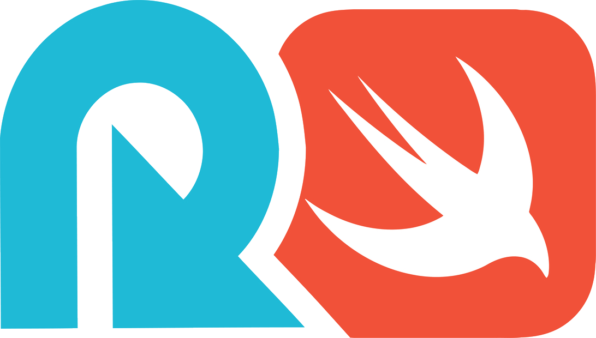

# Reloadly SDK for iOS and iPadOS

[](https://cocoapods.org/pods/ReloadlySDK)
[](https://github.com/Reloadly/reloadly-sdk-ios/blob/main/LICENSE)
[](https://cocoapods.org/pods/ReloadlySDK)
[](https://travis-ci.org/Reloadly/reloadly-sdk-ios)

The **Reloadly SDK** enables iOS developers to easily work with [Reloadly Services][reloadly-main-site]
and build scalable solutions.

* [SDK Homepage][sdk-website]
* [Sample Code][sample-code]
* [API Docs][docs-api]
* [Issues][sdk-issues]
* [Giving Feedback](#giving-feedback)
* [Getting Help](#getting-help)

## Getting Started

#### Sign up for Reloadly ####

Before you begin, you need a Reloadly account. Please see the [Sign Up for Reloadly][reloadly-signup-help] section of
the knowledge-base for information about how to create a Reloadly account and retrieve
your [Reloadly APIs credentials][api-credentials-help].

## Example

To run the example project, clone the repo, and run `pod install` from the Example directory first.
### Demo application
You can find examples at folder Example and run .workspace to test demo application with integrated SDK


## Requirements

Swift 4.0 and higher

## Installation

ReloadlySDK is available through [CocoaPods](https://cocoapods.org). To install
it, simply add the following line to your Podfile:

ReloadlySDK include both of SDK's Authentication and Airtime

```ruby
  pod 'ReloadlySDK/Airtime'
```

Also you can install separately, by default Airtime include Authentication SDK as dependency

```ruby
  pod 'ReloadlySDK/Airtime'
  pod 'ReloadlySDK/Authentication'
```


### Manually

To use this library in your project manually just drag and drop ReloadlySDK folder to your project.

## Usage

Import ReloadlySDK
```swift
import ReloadlySDK
```
Initialise library at `AppDelegate`

```swift
@UIApplicationMain
class AppDelegate: UIResponder, UIApplicationDelegate {

    var window: UIWindow?


    func application(_ application: UIApplication, didFinishLaunchingWithOptions launchOptions: [UIApplication.LaunchOptionsKey: Any]?) -> Bool {
        // Override point for customization after application launch.
        ReloadlyAuthentication.shared.configure(with: "clientID",
                                                clientSecret: "clientSecret",
                                                service: AuthenticationService(backendEnvironment: .sandbox))
        return true
    }
}

```

Also you can setup additional settings like logLevel, proxy configuration.

## Getting Help

GitHub [issues][sdk-issues] is the preferred channel to interact with our team. Also check these community resources for
getting help:

* Checkout & search our [knowledge-base][reloadly-knowledge-base]
* Talk to us live on our chat tool on our [website][reloadly-main-site] (bottom right)
* Ask a question on [StackOverflow][stack-overflow] and tag it with `reloadly-swift-sdk`
* Articulate your feature request or upvote existing ones on our [Issues][features] page
* Take a look at our [youtube series][youtube-series] for plenty of helpful walkthroughs and tips
* Open a case via with the [Reloadly Support Center][support-center]
* If it turns out that you may have found a bug, please open an [issue][sdk-issues]

## Giving Feedback

We need your help in making this SDK great. Please participate in the community and contribute to this effort by
submitting issues, participating in discussion forums and submitting pull requests through the following channels:

* Submit [issues][sdk-issues] - this is the preferred channel to interact with our team
* Come join the Reloadly swift community chat on [Gitter][gitter]
* Articulate your feature request or upvote existing ones on our [Issues][features] page
* Send feedback directly to the team at oss@reloadly.com

## License

This project is licensed under the MIT license. See the [LICENSE](LICENSE) file for more info.

[reloadly-main-site]: https://www.reloadly.com/

[sdk-website]: https://sdk.reloadly.com/ios

[reloadly-signup-help]: https://faq.reloadly.com/en/articles/2307724-how-do-i-register-for-my-free-account

[api-credentials-help]: https://faq.reloadly.com/en/articles/3519543-locating-your-api-credentials

[sdk-issues]: https://github.com/Reloadly/reloadly-sdk-ios/issues

[sdk-license]: http://www.reloadly.com/software/apache2.0/

[sample-code]: https://github.com/Reloadly/reloadly-sdk-ios/blob/main/Docs/Sample_code.md

[docs-api]: https://developers.reloadly.com

[features]: https://github.com/Reloadly/reloadly-sdk-ios/issues?q=is%3Aopen+is%3Aissue+label%3A%22feature-request%22

[api-docs]: https://developers.reloadly.com

[swiftdoc]: https://github.com/Reloadly/reloadly-sdk-ios

[lombok-plugins]: https://projectlombok.org/setup/overview

[mit-url]: https://github.com/reloadly/reloadly-sdk-java/raw/master/LICENSE

[codecov-badge]: https://codecov.io/gh/reloadly/reloadly-sdk-java/branch/main/graph/badge.svg?token=8U89VKQ2BF

[codecov-url]: https://app.codecov.io/gh/reloadly/reloadly-sdk-java

[youtube-series]: https://www.youtube.com/watch?v=TbXC4Ic8x30&t=141s&ab_channel=Reloadly

[reloadly-knowledge-base]: https://faq.reloadly.com

[stack-overflow]: http://stackoverflow.com/questions/tagged/reloadly-reloadly-sdk

[support-center]: https://faq.reloadly.com/en/articles/3423196-contacting-support
